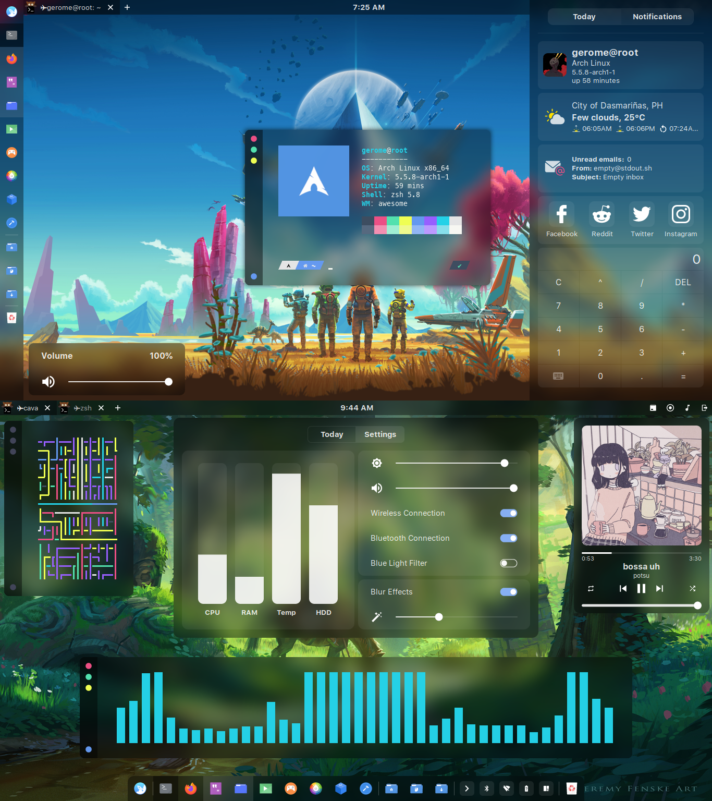

<div align="center">
    <h3>
    	
    </h3>
    <p align="center">
    	<strong>
    		a glorified dotfiles
    	</strong>
    </p>
</div>

<div align="center">
	
[](https://github.com/manilarome/the-glorious-dotfiles/commits/master) [](https://github.com/manilarome/the-glorious-dotfiles/pulls) [](http://hits.dwyl.com/manilarome/the-glorified-dotfiles)

</div>

<div align="center">
	<a href="https://github.com/manilarome/the-glorious-dotfiles/wiki">
		
	</a>
	<a href="https://github.com/manilarome/the-glorious-dotfiles/wiki/Dependencies">
		
	</a>
	<a href="https://github.com/manilarome/the-glorious-dotfiles/wiki/Getting-Started">
		
	</a>
	<a href="https://github.com/manilarome/the-glorious-dotfiles/wiki/Gallery">
		
	</a>
	<br><br>
</div>


<br>

### Welcome to the glorious dotfiles


<p align="left">
This is a collection/stash of my linux configurations also known as <b><i>dotfiles</i></b>. I don't know why did I wasted my time writing these, especially my AwesomeWM setups. Or maybe it's because... I did it for me. I liked it. I was good at it. And I was really -- I was alive. ;) So no wasted time after all.

About my setup, I'm using **Archlinux** btw, and I think everyone should know about that. **[AwesomeWM](https://awesomewm.org/)** is my window manager. I think it is best window manager in my honest opinion if you spend some effort and time into it.  The strength of it is its flexibility, you can create your own widget, panels, pop-ups, design your own UI/UX in whatever you like. That's the beauty of Awesome WM.

Anyway, I provided a documentation or **[wiki](https://github.com/manilarome/the-glorious-dotfiles/wiki)** focusing on my AwesomeWM setups. It also contains some useful information about ricing so I can help the aspiring linux ricers. Make sure to read it if you're planning to use my setups!
</p>

<br>
<br>


<p align="left">
So, what is ricing or RICE in the linux world? Ricing refers to making a visual improvement and customization on your desktop. It was inherited from the practice of improving, modifying, and customizing a cheap asian import cars to make them appear faster than they actually are. So in the world of cars, <b>RICE</b> means <i>Race Inspired Cosmetic Enhancement</i>.
<br>
<br>
Ricing is actually fun and it's my hobby for quite a long time now. Anyone can rice. Also, your distro doesn't matter. You can rice on ubuntu, manjaro, debian, and the list goes on. I'm just using archlinux because it's so easy to use and I love it. The pacman and aur is the selling point for me, and these guys prevent me to distrohop again. There's also no <i>"best"</i> in ricing. There's no best window manager, best distro, best icon theme, so stop asking that. That "best" one is the one that will compliment you and your workflow well. Experiment. Have a vision on what you are trying to do. Then, do it. Just do it. :wink: Enough with the blabbering and happy hacking! :)
</p>

<br>
<br>

## the glorious wiki's table of contents

This wiki will guide you to replicate my setups.

*  [**Home**](https://github.com/manilarome/the-glorious-dotfiles/wiki)
*  **General**
    - [Details](https://github.com/manilarome/the-glorious-dotfiles/wiki/Details)
	- [Features](https://github.com/manilarome/the-glorious-dotfiles/wiki/Features)
	- [Gallery](https://github.com/manilarome/the-glorious-dotfiles/wiki/Gallery)
	- [Dependencies](https://github.com/manilarome/the-glorious-dotfiles/wiki/Dependencies)
	   + [Required Dependencies](https://github.com/manilarome/the-glorious-dotfiles/wiki/Dependencies#required-dependencies)
	   + [Optional Dependencies](https://github.com/manilarome/the-glorious-dotfiles/wiki/Dependencies#optional-dependencies)
	- [Recommendations](https://github.com/manilarome/the-glorious-dotfiles/wiki/Recommended)
	   + [Recommended Packages](https://github.com/manilarome/the-glorious-dotfiles/wiki/Recommended#recommended-packages)
	   + [Recommended Fonts](https://github.com/manilarome/the-glorious-dotfiles/wiki/Recommended#recommended-fonts)
	- [Getting Started](https://github.com/manilarome/the-glorious-dotfiles/wiki/Getting-Started)
*  **Info**
    - [FAQs](https://github.com/manilarome/the-glorious-dotfiles/wiki/FAQs)
	- [How To's](https://github.com/manilarome/the-glorious-dotfiles/wiki/How-Tos)
	   + [Fix the errors on start-up](https://github.com/manilarome/the-glorious-dotfiles/wiki/How-Tos#fix-the-errors-on-start-up)
	   + [Fix the font](https://github.com/manilarome/the-glorious-dotfiles/wiki/How-Tos#fix-font)
	   + [Fix rofi size](https://github.com/manilarome/the-glorious-dotfiles/wiki/How-Tos#fix-rofi-application-menu-size)
	   + [Fix rofi font](https://github.com/manilarome/the-glorious-dotfiles/wiki/How-Tos#fix-rofi-font)
	   + [Fix Resolution](https://github.com/manilarome/the-glorious-dotfiles/wiki/How-Tos#fix-resolution)
	   + [Use the Powerlevel10k prompt](https://github.com/manilarome/the-glorious-dotfiles/wiki/How-Tos#use-the-powerlevel10k-prompt)
	   + [Rice Qt5 apps](https://github.com/manilarome/the-glorious-dotfiles/wiki/How-Tos#rice-qt5-apps-on-non-plasma-environment)
	- [Keybindings](https://github.com/manilarome/the-glorious-dotfiles/wiki/Keybindings)
	- [File Structure](https://github.com/manilarome/the-glorious-dotfiles/wiki/File-Structure)
	- [About Widgets](https://github.com/manilarome/the-glorious-dotfiles/wiki/About-Widgets)
	   + [Weather Widget](https://github.com/manilarome/the-glorious-dotfiles/wiki/About-Widgets#weather-widget)
	   + [Email Widget](https://github.com/manilarome/the-glorious-dotfiles/wiki/About-Widgets#email-widget)
	   + [Calculator Widget](https://github.com/manilarome/the-glorious-dotfiles/wiki/About-Widgets#calculator-widget)
	   + [Trash Widget](https://github.com/manilarome/the-glorious-dotfiles/wiki/About-Widgets#trash-widget)
	   + [Music Widget](https://github.com/manilarome/the-glorious-dotfiles/wiki/About-Widgets#music-widget)
	   + [Screen-recorder Widget](https://github.com/manilarome/the-glorious-dotfiles/wiki/About-Widgets#screen-recorder-widget)
	   + [Global Search Widget](https://github.com/manilarome/the-glorious-dotfiles/wiki/About-Widgets#global-search-rofi)
	- [About Modules](https://github.com/manilarome/the-glorious-dotfiles/wiki/About-Modules)
	   + [Lockscreen Module](https://github.com/manilarome/the-glorious-dotfiles/wiki/About-Modules#lockscreen-module)
	   + [Titlebar Module](https://github.com/manilarome/the-glorious-dotfiles/wiki/About-Modules#titlebar-module)
	   + [Dynamic Wallpaper Module](https://github.com/manilarome/the-glorious-dotfiles/wiki/About-Modules#dynamic-wallpaper-module)
	   + [Exit Screen Module](https://github.com/manilarome/the-glorious-dotfiles/wiki/About-Modules#exit-screen-module)
	   + [Backdrop Module](https://github.com/manilarome/the-glorious-dotfiles/wiki/About-Modules#backdrop-module)
	   + [Menu Module](https://github.com/manilarome/the-glorious-dotfiles/wiki/About-Modules#menu-module)
*  [**More Info**](https://github.com/manilarome/the-glorious-dotfiles/wiki/More)
*  [**TODOs**](https://github.com/manilarome/the-glorious-dotfiles/wiki/TODOs)
*  [**Issues**](https://github.com/manilarome/the-glorious-dotfiles/wiki/Issues)
*  [**Acknowledgement**](https://github.com/manilarome/the-glorious-dotfiles/wiki/Acknowledgement)
*  [**Epilogue**](https://github.com/manilarome/the-glorious-dotfiles/wiki/Epilogue)

<br>
<br>

## summary and details

If you're too lazy to open the wiki, here's some of the details you need to know.

### starring

- [`archlinux`](https://www.archlinux.org/download/) as distribution
- [`awesomewm`](https://awesomewm.org) as window manager
- [`kitty`](https://github.com/kovidgoyal/kitty) as terminal emulator
- [`tryone144's picom`](https://github.com/tryone144/compton/tree/feature/dual_kawase) as compositor
- [`rofi-git branch`](https://github.com/davatorium/rofi) as application launcher
- [`SF Pro Text`](https://developer.apple.com/fonts/) as the setup font
- [`trivago`](https://www.youtube.com/watch?v=dQw4w9WgXcQ) as hotel

### required dependencies

| Name | Description | Why/Where is it needed? |
| --- | --- | --- |
| [`awesome-git`](https://github.com/awesomeWM/awesome) |  Highly configurable framework window manager | isn't it obvious? |
| [`rofi-git`](https://github.com/davatorium/rofi) | Window switcher, application launcher and dmenu replacement | Application launcher |
| [`tryone144's picom`](https://github.com/tryone144/compton/tree/feature/dual_kawase) | A compositor for X11 | a compositor with kawase-blur |

### installation and usage

1. Install the [required dependencies](#required-dependencies). Note that there's also an [optional dependencies](https://github.com/manilarome/the-glorious-dotfiles/wiki/Dependencies#optional-dependencies).
2. Clone this repository.

	```bash
	$ git clone --depth=1 https://github.com/manilarome/the-glorious-dotfiles/
	```

3. Make sure to create a backup if you have a current AwesomeWM configuration.
4. Copy the `the-glorious-dotfiles/config/awesome/SETUPNAME` folder to your `"${HOME}"/.config/`. I'll just assume that you don't have an `awesome` folder in your `~/.config/`:

	```bash
	# Use the Floppy setup
	$ cp -r the-glorious-dotfiles/config/awesome/floppy $HOME/.config/awesome

	# Use the GNawesOME setup
	$ cp -r the-glorious-dotfiles/config/awesome/gnawesome $HOME/.config/awesome

	# Use the Linear setup
	$ cp -r the-glorious-dotfiles/config/awesome/linear $HOME/.config/awesome
	```

5. Reload AwesomeWM by pressing <kbd>Super + Shift + r</kbd>.

## todos

My TODOs or roadmap for my awesomewm setups.

- [x] Scrollable Notification Center<sup>needs improvement</sup>
- [x] Lockscreen PAM Integration
- [x] Multi-monitor support  
- [x] Refactor for cleaner code<sup>WIP</sup>
- [x] Extend the screen recorder widget's functionality
- [x] Adjust picom's blur strength using a slider


## selling the dotfiles

Why would I want this?

### core Features

These are the features included in my AwesomeWM setups!

+ Notification Center
+ Dynamic Wallpaper
+ File/Web Searching like macOS' Spotlight
+ Application Dashboard
+ Brightness and Volume OSDs
+ Functional Trash Widget
+ Built-in Screen Recorder Widget
+ Built-in Calculator Widget
+ Email Widget
+ Weather Widget
+ Quake Terminal
+ Hardware Monitor
+ Blue Light Filter Widgets 
+ Lockscreen Module with Face Capture and PAM Integration
+ Easter eggs!<sup>Mostly bugs</sup>
+ Any many more!

### mini gallery

Some of these are outdated, so it is better if you try them yourself. 

| Floppy |
| --- |
|  |

| GNawesOME |
| --- |
|  |

| Linear |
| --- |
|  |

| Lockscreen with **PAM Integration** |
| --- |
|  |

| Exit Screen |
| --- |
|  |

| Multihead |
| --- |
|  |

| Rofi File Browsing | Rofi Context Menu |
| --- | --- |
|  |  |

| Rofi Google Suggestion | Rofi DuckDuckGo Suggestion |
| --- | --- |
|  |  |

<br>

Main gallery [here](https://github.com/manilarome/the-glorious-dotfiles/wiki/Gallery).
