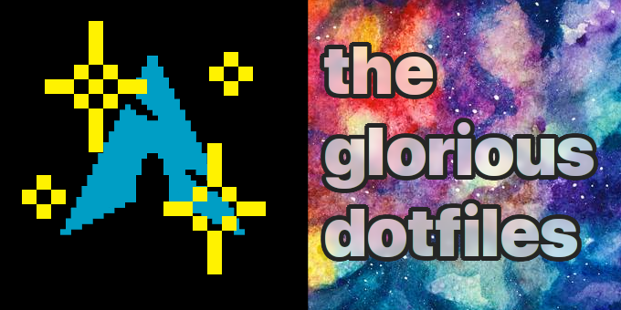
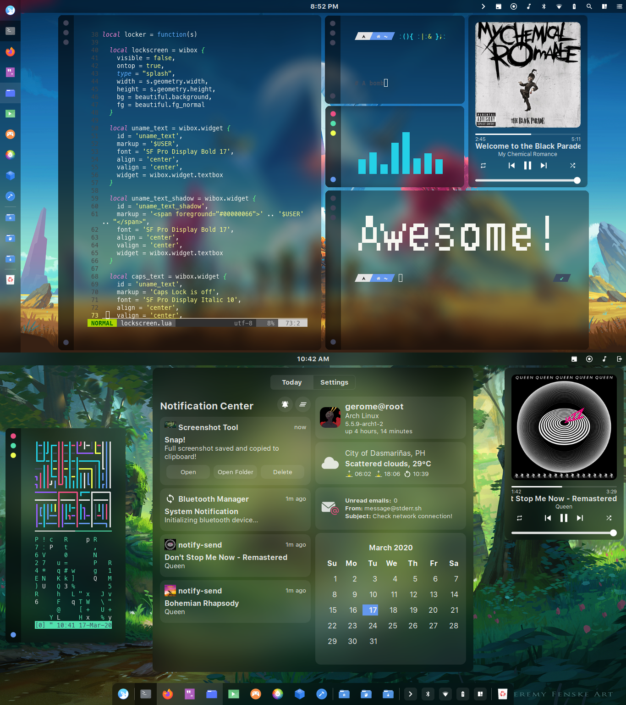

    <h3>
    	
    </h3>
    

    	<strong>
    		a glorified dotfiles
    	</strong>
    

	
	
	
	
	 

## the glorious wiki

#### the table of contents

- **[Home](https://github.com/manilarome/the-glorious-dotfiles/wiki)**
- **General**
	- [Details](https://github.com/manilarome/the-glorious-dotfiles/wiki/Details)
	- [Features](https://github.com/manilarome/the-glorious-dotfiles/wiki/Features)
	- [Gallery](https://github.com/manilarome/the-glorious-dotfiles/wiki/Gallery)
	- [Dependencies](https://github.com/manilarome/the-glorious-dotfiles/wiki/Dependencies)
		- [Required Dependencies](https://github.com/manilarome/the-glorious-dotfiles/wiki/Dependencies#required-dependencies)
		- [Optional Dependencies](https://github.com/manilarome/the-glorious-dotfiles/wiki/Dependencies#optional-dependencies)
	- [Recommendations](https://github.com/manilarome/the-glorious-dotfiles/wiki/Recommended)
		- [Recommended Packages](https://github.com/manilarome/the-glorious-dotfiles/wiki/Recommended#recommended-packages)
		- [Recommended Fonts](https://github.com/manilarome/the-glorious-dotfiles/wiki/Recommended#recommended-fonts)
	- [Getting Started](https://github.com/manilarome/the-glorious-dotfiles/wiki/Getting-Started)
- **Info**
	- [FAQs](https://github.com/manilarome/the-glorious-dotfiles/wiki/FAQs)
	- [How To's](https://github.com/manilarome/the-glorious-dotfiles/wiki/How-Tos)
	- [Keybindings](https://github.com/manilarome/the-glorious-dotfiles/wiki/Keybindings)
	- [File Structure](https://github.com/manilarome/the-glorious-dotfiles/wiki/File-Structure)
	- [About Widgets](https://github.com/manilarome/the-glorious-dotfiles/wiki/About-Widgets)
		- [Weather Widget](https://github.com/manilarome/the-glorious-dotfiles/wiki/About-Widgets#weather-widget)
		- [Email Widget](https://github.com/manilarome/the-glorious-dotfiles/wiki/About-Widgets#email-widget)
		- [Calculator Widget](https://github.com/manilarome/the-glorious-dotfiles/wiki/About-Widgets#calculator-widget)
		- [Trash Widget](https://github.com/manilarome/the-glorious-dotfiles/wiki/About-Widgets#trash-widget)
		- [Music Widget](https://github.com/manilarome/the-glorious-dotfiles/wiki/About-Widgets#music-widget)
		- [Screen-recorder Widget](https://github.com/manilarome/the-glorious-dotfiles/wiki/About-Widgets#screen-recorder-widget)
	- [About Modules](https://github.com/manilarome/the-glorious-dotfiles/wiki/About-Modules)
		- [Lockscreen Module](https://github.com/manilarome/the-glorious-dotfiles/wiki/About-Modules#lockscreen-module)
		- [Titlebar Module](https://github.com/manilarome/the-glorious-dotfiles/wiki/About-Modules#titlebar-module)
		- [Dynamic Wallpaper Module](https://github.com/manilarome/the-glorious-dotfiles/wiki/About-Modules#dynamic-wallpaper-module)
		- [Exit Screen Module](https://github.com/manilarome/the-glorious-dotfiles/wiki/About-Modules#exit-screen-module)
		- [Backdrop Module](https://github.com/manilarome/the-glorious-dotfiles/wiki/About-Modules#backdrop-module)
		- [Menu Module](https://github.com/manilarome/the-glorious-dotfiles/wiki/About-Modules#menu-module)
- **[More Info](https://github.com/manilarome/the-glorious-dotfiles/wiki/More)**
- **[TODOs](https://github.com/manilarome/the-glorious-dotfiles/wiki/TODOs)**
- **[Issues](https://github.com/manilarome/the-glorious-dotfiles/wiki/Issues)**
- **[Acknowledgement](https://github.com/manilarome/the-glorious-dotfiles/wiki/Acknowledgement)**
- **[Epilogue](https://github.com/manilarome/the-glorious-dotfiles/wiki/Epilogue)**

