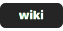
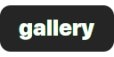

<div align='center'>
    <h3>
    	
    </h3>
    <p align='center'>
    	<strong>
    		a glorified dotfiles
    	</strong>
    </p>
</div>

<div align='center'>

[](https://github.com/manilarome/the-glorious-dotfiles/commits/master) [](https://github.com/manilarome/the-glorious-dotfiles/pulls) [](http://hits.dwyl.com/manilarome/the-glorified-dotfiles)

</div>

<div align='center'>
	<a href='https://github.com/manilarome/the-glorious-dotfiles/wiki'>
		
	</a>
	<a href='https://github.com/manilarome/the-glorious-dotfiles/wiki/Dependencies'>
		
	</a>
	<a href='https://github.com/manilarome/the-glorious-dotfiles/wiki/Getting-Started'>
		
	</a>
	<a href='https://github.com/manilarome/the-glorious-dotfiles/wiki/Gallery'>
		
	</a>
	<br>
	<br>
</div>

<p align='center'>
	
	<br/>
	<b>
		Welcome to the glorious dotfiles!
	</b>
</p>

<p align='center'>
	<br/>
	This is a collection/stash of my linux configurations also known as dotfiles. I don't know why did I wasted my time writing these, especially my AwesomeWM setups. Or maybe it's because... I did it for me. I liked it. I was good at it. And I was really -- I was alive. ;) So no wasted time after all. You're probably here because of my awesome dotfiles. So yeah, steal what you want. Don't forget to check my <a href='https://github.com/manilarome/'>other projects!</a>
</p>


## [Wiki here](https://github.com/manilarome/the-glorious-dotfiles/wiki)

The wiki will guide you to replicate my setups. So read the frickin' manual! If you post an issue that can be solve by reading it, I'll drop kick you.

## Summary and details

If you're too lazy to read the wiki, here's some of the details you need to know.

### Starring

- [`archlinux`](https://www.archlinux.org/download/) as distribution
- [`fish`](https://fishshell.com/) as shell
- [`awesomewm`](https://awesomewm.org) as window manager
- [`kitty`](https://github.com/kovidgoyal/kitty) as terminal emulator
- [`picom-git`](https://github.com/yshui/picom) as compositor
- [`rofi`](https://github.com/davatorium/rofi) as application launcher
- [`inter-font`](https://github.com/rsms/inter/) as the setup font
- [`trivago`](https://www.youtube.com/watch?v=dQw4w9WgXcQ) as hotel

### Required dependencies

| Name | Description | Why/Where is it needed? |
| --- | --- | --- |
| [`awesome-git`](https://github.com/awesomeWM/awesome) |  Highly configurable framework window manager | Isn't it obvious? |
| [`rofi`](https://github.com/davatorium/rofi) | Window switcher, application launcher and dmenu replacement | Application launcher |
| [`picom-git`](https://github.com/yshui/picom) | A compositor for X11 | A compositor with kawase-blur |
| [`inter-font`](https://github.com/rsms/inter/) | A typeface specially designed for user interfaces | Setup font | 

### Installation and usage

1. Install the [required dependencies](#required-dependencies). Note that there's also an [optional dependencies](https://github.com/manilarome/the-glorious-dotfiles/wiki#optional-dependencies).
2. Clone this repository.

	```bash
	$ git clone --depth 1 https://github.com/manilarome/the-glorious-dotfiles/
	```

3. Make sure to create a backup if you have a current AwesomeWM configuration.
4. Copy the `the-glorious-dotfiles/config/awesome/SETUPNAME` folder to your `"${HOME}"/.config/`. I'll just assume that you don't have an `awesome` folder in your `~/.config/`:

	```bash
	# Use the Floppy setup
	$ cp -r the-glorious-dotfiles/config/awesome/floppy $HOME/.config/awesome

	# Use the GNawesOME setup
	$ cp -r the-glorious-dotfiles/config/awesome/gnawesome $HOME/.config/awesome

	# Use the Linear setup
	$ cp -r the-glorious-dotfiles/config/awesome/linear $HOME/.config/awesome

	# Use the Surreal setup
	$ cp -r the-glorious-dotfiles/config/awesome/surreal $HOME/.config/awesome
	```

4. Change the global configuration in `$HOME/.config/awesome/configuration/config.lua`.
5. Reload AwesomeWM by pressing <kbd>Super + Shift + r</kbd>.

## TODOs

My TODOs or roadmap for my awesomewm setups.

- [x] Scrollable Notification Center<sup>needs improvement</sup>
- [x] Lockscreen PAM Integration
- [x] Multi-monitor support  
- [x] Refactor for cleaner code<sup>WIP</sup>
- [x] Extend the screen recorder widget's functionality
- [x] Adjust picom's blur strength using a slider


## Selling the dotfiles

Why would I want this?

### Core features

These are the features included in my AwesomeWM setups!

+ Notification Center
+ Dynamic Wallpaper
+ File/Web Searching like macOS' Spotlight
+ Application Dashboard
+ Brightness and Volume OSDs
+ Functional Trash Widget
+ Built-in Screen Recorder Widget
+ Built-in Calculator Widget
+ Email Widget
+ Weather Widget
+ Quake Terminal
+ Hardware Monitor
+ Blue Light Filter Widgets 
+ Lockscreen Module with Face Capture and PAM Integration
+ Easter eggs!<sup>Mostly bugs</sup>
+ Any many more!

I don't really rice just to make it beautiful, I want it to be also functional so that's why it's ***"bloated"*** with features.

### Gallery

Some of these are outdated, so it is better if you try them yourself. 

<p align='center'>
	
	<br/>
	<b>
		Floppy
	</b>
	<br>
	Floppy was meant to be a clone of the infamous <a href='https://www.reddit.com/r/unixporn/comments/apktsx/flurry_i_know_you_like_tiling_managers_and_i_want/'>Flurry Desktop</a>. I named it Floppy because I thought it would flop when I first <a href='https://www.reddit.com/r/unixporn/comments/de0m3v/awesome_floppy/'>posted it on r/unixporn</a>. This is my favorite.
	<br>
</p>

<p align='center'>
	
	<br/>
	<b>
		GNawesOME
	</b>
	<br>
	Yes, GNawesOME is a weird name. GNawesOME was meant to be a GNOME clone. Instead, it became a hybrid of macOS, iOS, GNOME, and Deepin. I regret nothing.
	<br>
</p>

<p align='center'>
	
	<br/>
	<b>
		Linear
	</b>
	<br>
	A setup full of borders and lines. Awesome right?
	<br>
</p>

<p align='center'>
	
	<br/>
	<b>
		Surreal
	</b>
	<br>
	Yes, I copied the macOS Big Sur design. Many linux elitists will hate it but I don't care. Cry me a river.
	<br>
</p>

#### More screenshots

| Lockscreen with [PAM Integration](https://github.com/RMTT/lua-pam) |
| --- |
|  |

| Application Menu |
| --- |
|  |

| Exit Screen |
| --- |
|  |

| Multihead |
| --- |
|  |

| [Rofi Global Search](https://github.com/manilarome/rofi-spotlight) |
| --- |
|  |

| [blurredfox CSS theme for Firefox](https://github.com/manilarome/blurredfox/) |
| --- |
|  |

| [glorious - lightdm-webkit2-theme](https://github.com/manilarome/lightdm-webkit2-theme-glorious/) |
| --- |
|  |

| [thunderblurred CSS theme for Thunderbird](https://github.com/manilarome/thunderblurred) |
| --- |
|  |

## Credits

Grazie

- [Contributors](https://github.com/manilarome/the-glorious-dotfiles/graphs/contributors)
- [awesomewm devs](https://github.com/awesomeWM/awesome/graphs/contributors)
- The community of course
