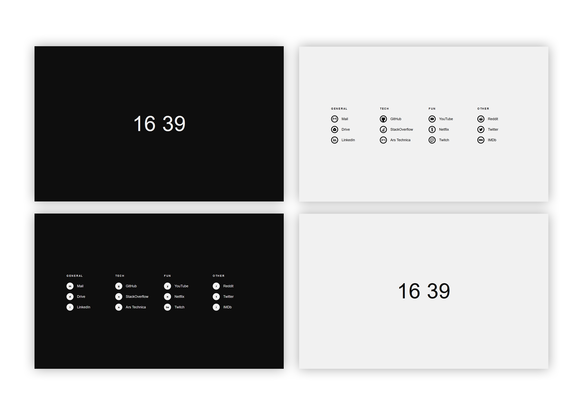

# Tilde Enhanced

Based on [Cade Scroggins](https://github.com/cadejscroggins)'s [Tilde](https://github.com/cadejscroggins/tilde).

## Screenshots 

## Added Features
Most of the features are carried over from the original source.
Few of the added features are:

- Added a "Quick Launch" functionality, which launches all the sites with `quickLaunch` 
property set to true upon hitting `!` key.
- Clicking on the clock brings up pre-defined sites.
- Available sites show their icons instead of their corresponding keys.
- Added the option to reverse colour theme. You can either edit config or use `reverse!` command.
- Other small changes on grids.

## Usage

To use Tilde as your homepage, simply set your browser's home URL to
Tilde's index file.
To go to a site, enter the first letter of the site then hit enter.
To view the available sites, press `?` or click on the clock.
If your input doesn't match any of the commands,
a generic DuckDuckGo search will be triggered. For example:

- Entering `r` would redirect you to [www.reddit.com](https://www.reddit.com).
- Entering `t` would redirect you to [twitch.tv](https://www.twitch.tv).
- Entering `cats` would search [Cats](https://duckduckgo.com/?q=cats).

Note that by default, queries are searched on DuckDuckGo but this can be
configured easily by updating two lines on. Check [Configuration](#configuration) for details.

You might have to allow pop-ups for your homepage to use quick launch feature.

This version is not suitable for use on mobile as clicking on the clock will
only bring up pre-defined sites.

### Searching

You can search any of the sites by typing a colon after the site's key, followed
by your search query. For example:

- Entering `g:tilde-enhanced` would search
  [GitHub for tilde-enhanced](https://github.com/search?q=tilde-enhanced).
- Entering `y:cats` would search
  [Cats on YouTube](https://www.youtube.com/results?search_query=cats).

### Specific Locations

You can go to a specific location on a site by typing a forward slash after the
site's key, followed by the location on the site you'd like to be redirected to.
For example:

- Entering `r/r/startpages` would redirect you to
  [www.reddit.com/r/startpages](https://www.reddit.com/r/startpages)
- Entering `h/popular` would redirect you to
  [hypem.com/popular](http://hypem.com/popular).

### URL Redirects

If you enter in a full domain or URL, you will be redirected to said domain or
URL. For example:

- Entering `stallman.org` would redirect you to
  [stallman.org](https://stallman.org/).
- Entering `keep.google.com` would redirect you to
  [keep.google.com](https://keep.google.com/).

### Query Paramater

Additionally, you can pass any query via the `q` query param. For example:

- Going to `file:///path/to/tilde/index.html?q=cats` would search
  [Cats](https://duckduckgo.com/?q=cats).

This allows you to invoke Tilde with your native browser search bar.

## Configuration

Open up the [script.js](assets/script.js) file and read through the `CONFIG`!

## License

Feel free to [use this and modify it however you like](https://github.com/Ozencb/tilde-enhanced/blob/master/LICENSE).
